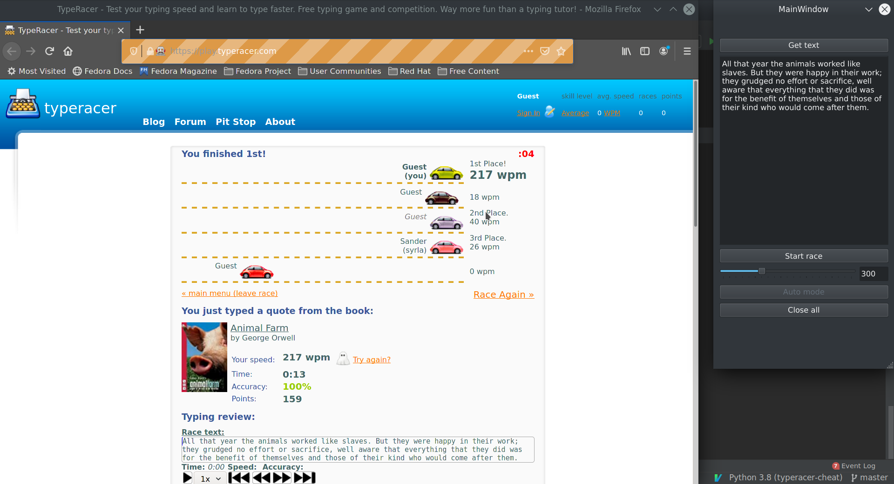
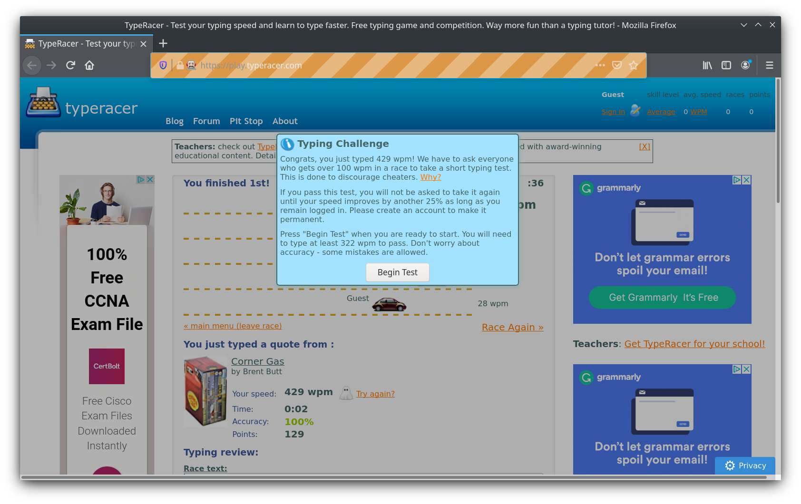
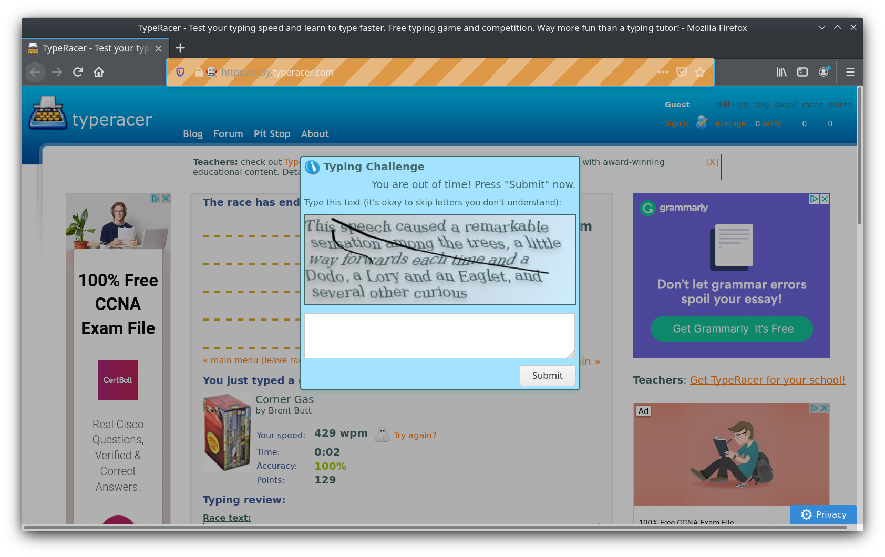

# typeracer-bot
Simple bot program to play [TypeRacer](https://play.typeracer.com/) written in Python and Selenium

## Requirements

- Python 3
- dependencies in [requirements.txt](requirements.txt)
- Firefox
- geckodriver

## Usage

To be able to run the program you will need to:
- download the [geckodriver](https://github.com/mozilla/geckodriver/releases)
(alternatively you can install it on your machine)
- add the directory containing the executable (downloaded driver) to the system path

something like this:
```console
$ export PATH=$PATH:/path/to/directory/of/downloaded/executable
```

- after that you should be able to successfully run
```console
$ python main.py
```

## GUI

Recently there has been control panel (PySide2) added to the project. It should make user experience more comfortable.
Here is a screenshot of how it looks like.



## Anti Bot

At some point you will see the challenge message (left image).  
After you click *Begin test* you will be asked to type text from specific image (right image).

|||
---|---

In future I will use OCR to try to pass the test.

