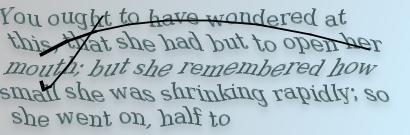
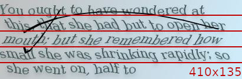
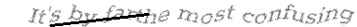
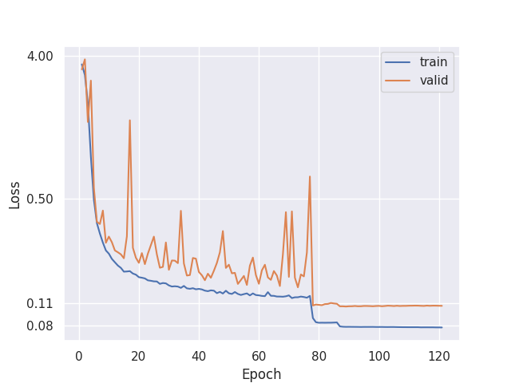
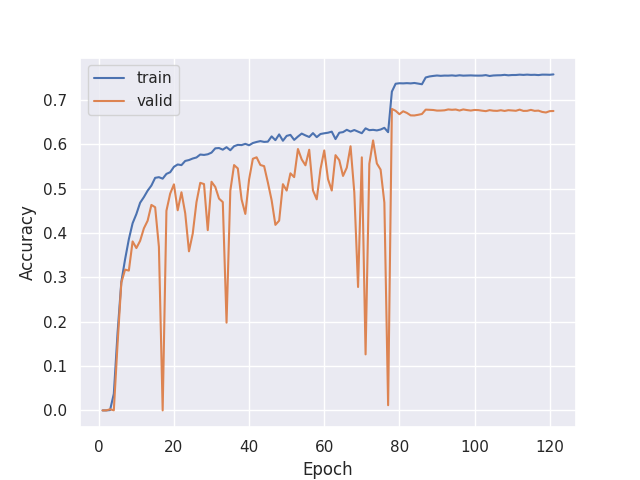

# Challenge solving

## Intro

A TypeRacer challenge is a CAPTCHA-like image, which you encounter if you complete a match with typing speed higher than 100wpm. In order to pass it you have to type in text from given image. It is [designed](https://blog.typeracer.com/2008/05/19/new-speedometer-and-improved-cheat-protection/) to discourage cheating (usage of automated bots).

I've tried using tesseract OCR, admittedly with default settings, and it doesn't seem to work. Because of this I decided to try building a neural network to solve the challenge.

## Solution

At the time of writing this, all challenge images have fixed size and can be neatly divided into 5 equal horizontal strips. This greatly simplifies the challenge and makes it a "simple" CAPTCHA recognition problem of one-line text.

There are lots of guides for solving CAPTCHAs with neural networks, I followed closely [this one](https://www.kaggle.com/code/gokulkarthik/captcha-text-recognition-using-crnn-in-pytorch) and also kept open [this one](https://www.kaggle.com/code/aakashnain/building-a-captcha-ocr-in-tf2-0/notebook).
In the guides authors used [Convolutional Recurrent Neural Network](https://arxiv.org/pdf/1507.05717.pdf). They provided some code which I adapted and placed in [`challenge_solver/training/`](training) directory.

## Data preparation

Since challenges are generated on the fly, it doesn't seem like there is a dataset to train on. I manually collected a small dataset of challenges which initially served as a test set. You can find it in [`challenge_solver/training/test_data/`](training/test_data). For a train set I decided to use synthetic data.

To generate train data I used [text_renderer](https://github.com/oh-my-ocr/text_renderer) project. It allows to generate text line images for training deep learning OCR models. In [`challenge_solver/data_generation/`](data_generation) I put configs and files used for generating custom dataset.

Ideally, you'd want to match synthetic data to target data. Specifically font, font size, distortions and effects and also background. If it's not possible (like in this case, since I don't know the target font or how to fully replicate effects) you can widen the scope of configuration and hope your model will generalize well to target data. 

Configs I used worth mentioning:

- list of fonts visually similar to the target font ([`challenge_solver/data_generation/font_list/font_list.txt`](data_generation/font_list/font_list.txt), have to be downloaded)
- font size of 28-29, pretty close
- implemented wave warp or sine effect (full list of effects in [`challenge_solver/data_generation/config.py`](data_generation/config.py))
- used plain white background, since color can be removed from target images using thresholding (see [`challenge_solver/ocr.py`](ocr.py))
- used "Alice's Adventures in Wonderland" as a corpus ([source](https://gist.github.com/phillipj/4944029#file-alice_in_wonderland-txt)), preprocessing needed (rarely occurring characters removal, whitespace trimming) 

Example of generated image:

## Training

For training, I generated dataset of 60000 labeled images, with effective size of ~56000 due to max image width (410) being exceeded in some cases.

Hyperparameters:
- batch_size = 256
- learning_rate = 1e-3
- rnn_hidden_size = 256

|  |  |
|-------------------------|-----------------------------|

For measuring accuracy, I used [`accuracy_score`](https://scikit-learn.org/stable/modules/generated/sklearn.metrics.accuracy_score.html) from sklearn. After training the accuracy on the test set was 0, so I fine-tuned the model on a part of the test set, after which the accuracy went up to almost 1.

## Inference

The trained model is saved in [`challenge_solver/trained_models/`](trained_models) directory for inference. All processing is done in 
[`challenge_solver/ocr.py`](ocr.py). Model's accuracy on challenges according to TypeRacer is >96%, which is more than enough to pass it.